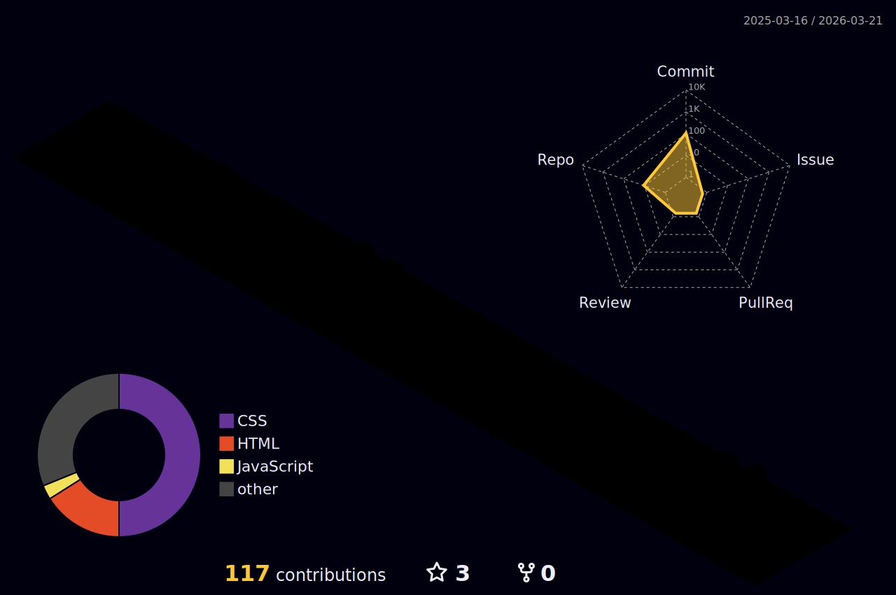

  

<h1 align="center">
  Olá 👋 Eu sou o Wilbe Souza
</h1>

<h3 align="center">
  💻 Desenvolvedor Web | HTML • CSS • JavaScript • PHP • MySQL
</h3>

  Em busca de uma oportunidade como Desenvolvedor Web Trainee.

---

## 🚀 Sobre mim

Sou desenvolvedor web formado recentemente, focado em desenvolvimento front-end e back-end.
Tenho experiência prática com projetos reais em estudos, criação de portfólio responsivo, 
controle de versão com Git e publicação via GitHub Pages.

Atualmente busco minha primeira oportunidade profissional na área de desenvolvimento.

---

## 🛠 Tecnologias

  

---

## 📊 Estatísticas

  

  

---

## 🌐 Contato

  
  
  
  
  

---

  Obrigado pela visita 🚀

  

